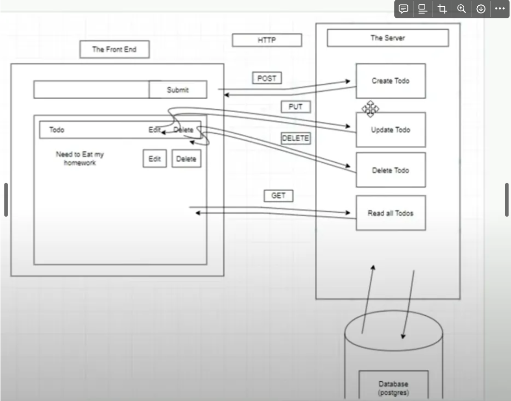
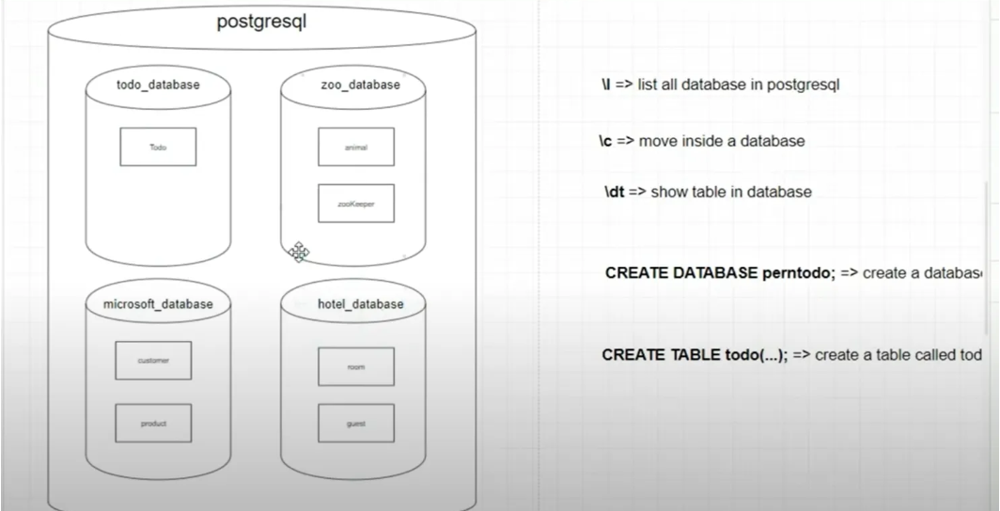
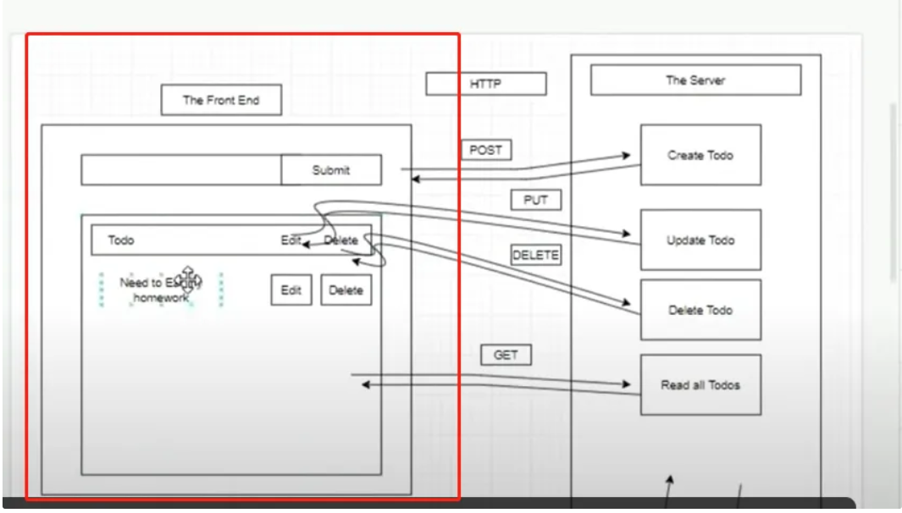

# pern-todo-app-IDWD项目整体预览

# 介绍：

- 这是个运用express、node.js、React、Postgres技术栈构建的简单todo项目
- pern 指---express、node.js、React、Postgres
- todo 指--任务列表
- app  应用
- IDWD ---Independent Development Workflow Demonstration

# 目的：

- 为这个项目构建自动化集成、CI/CD的环境、
- 运用到git、Docker、Jenkins等工具
- 实现对于DDT、独立开发实践整个项目的工作流项目示例    

## 开发部分（已完成）

> Overview Diagram   设计概况图
>
> - 

### 一：后端建设

> 1..Build our Server

- 通过express、node.js建构
- 

> 2.Create Postgres Database and Table

> 3.Connect Our Postgres Database and Server

- 连接server和Postgres

> 4.构建restful api

- post
- get
- put
- delete

> 5.Build Routes with Postgres Queries  使用 Postgres 查询构建路由

### 二、前端建设

> 1.Set Up Client Side  -创建前端

- npx create-react-app client
- 

> 2.创建前端组件

- Build the input Todo Component
- Build the list Todo Component
- Build the Delete Button
- Build the Edit Todo Component

## 三、测试
- 
- project/
├── client/                     # 前端
│   └── src/
│       └── components/
│           └── __tests__/     # React组件测试
├── server/                     # 后端
│   └── __tests__/
│       ├── unit/              # 单元测试
│       └── integration/       # 集成测试
└── e2e/                       # 端到端测试
    └── specs/                 # 测试用例  

## 项目结构
\`\`\`
project/
├── client/          # React 前端
├── server/          # Express 后端
└── e2e/             # 端到端测试
\`\`\`

## 开发指南
1. 克隆项目
2. 安装依赖
3. 运行开发服务器

## 测试
- 单元测试
- 集成测试
- E2E 测试

## Git 工作流
- main: 生产环境
- develop: 开发环境
- feature/*: 新功能
- test/*: 测试相关

## 后续开发
创建新功能:
git checkout -b feature/新功能名 develop
# 开发完成后
git push -u origin feature/新功能名
# 在 GitHub 创建 Pull Request 到 develop 分支
添加测试:
git checkout -b test/添加测试 develop
# 添加测试文件
git add .
git commit -m "test: 添加单元测试"